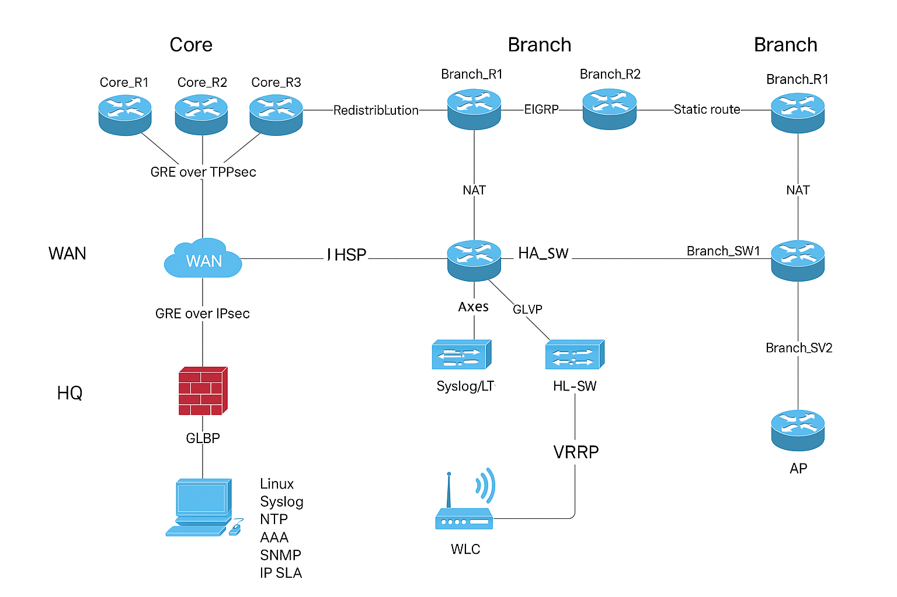

# Enterprise Routing Lab

This is a comprehensive project that consolidates over 100+ labs from Cisco's CCNP ENARSI curriculum into a unified, simulated enterprise network. Designed for Cisco Modeling Labs (CML), this lab is ideal for practicing routing, security, monitoring, and wireless implementations in an enterprise setting.

---

## Network Topology



Includes:
- Core and distribution switches
- Two branch routers with access switches
- DMVPN Hub & Spokes
- Central Firewall with NAT/ZBF
- Wireless LAN Controller + AP
- Monitoring server with Syslog, SNMP, NetFlow, NTP, AAA
- Full IPv4 & IPv6 routing: EIGRP, OSPFv2/v3, BGP, Redistribution, VRF, GRE, IPsec

---

## Technologies Covered

- ✅ Static & Dynamic Routing (EIGRP, OSPFv2/v3, BGP)
- ✅ Route Redistribution, Summarization, Path Manipulation
- ✅ VRF-Lite, GRE Tunnels, DMVPN Phases 1 & 3, IPsec VPNs
- ✅ NAT (Static/Dynamic), DHCP, HSRP, VRRP, GLBP
- ✅ VLANs, VTP, STP, EtherChannel, Inter-VLAN Routing
- ✅ IPv4/IPv6 ACLs, Route Maps, PBR, Prefix Lists
- ✅ ZBF (Zone-Based Firewall), CoPP, uRPF, Secure SSH
- ✅ AAA (RADIUS), Syslog, SNMP, IP SLA, NetFlow
- ✅ Wireless: WLC with WPA2 Enterprise, AP registration

---

## Project Structure

```
configs/
├── core/         # Core, HA switching
├── branch/       # Branch R1, R2, Access SW
├── dmvpn/        # Hub, Spoke1, Spoke2
├── firewall/     # Main perimeter firewall
├── wireless/     # WLC + AP
├── server/       # Linux monitoring setup
└── security/     # Secure hardening template

scripts/
└── linux_monitoring_server_setup.sh
```

---

## How to Use

1. Import the topology into Cisco Modeling Labs (CML)
2. Apply configuration files to devices
3. Use the diagnostic tickets to test your troubleshooting skills
4. Test connectivity, failover, and management plane functionality

---

## Author

**Oleksandr Yemelianov**  
[LinkedIn Profile](https://www.linkedin.com/in/yemelianovaleksandr)

---

## License

This project is licensed under the MIT License - see the [LICENSE](LICENSE) file for details.
